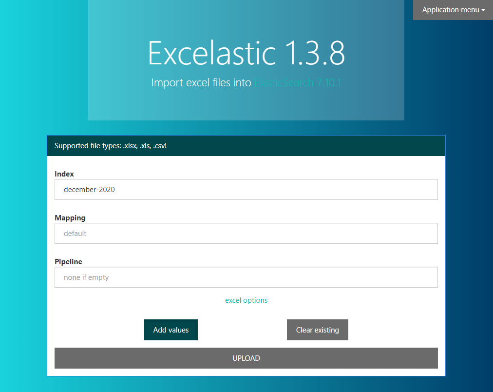

# excelastic [](https://travis-ci.org/codingchili/excelastic)

Parses XLSX/XLS/CSV files into ElasticSearch using column titles from a specified row combined with data in columns on each row. May be used with Kibana or other visualization applications, example result using a transaction log in excel format  [image](https://raw.githubusercontent.com/codingchili/parser-banktrans-es/master/sample-redacted.png). The application comes with a web-interface to simplify uploading.



## Features
- import excel (.xlsx/.xls) files into ElasticSearch.
- easy to use web interface, with support for commandline imports too.
- csv files can be converted to .xlsx using office and then imported.
- clear the index before importing, or append to existing index.
- basic authentication when uploading from the application to elasticsearch.
- support for importing to TLS enabled elasticsearch servers.
- supports concurrent parsing of excel files and importing for better performance.
- parses the whole file before starting the import - to make sure your index is not left in an undesired state.
- specify elasticsearch ingest pipeline for a given spreadsheet.

## Prerequisites
The application requires ElasticSearch as its output.

1. ElasticSearch (version 5+/6+/7+) should not require any additional configuration or installation, just download and run from [Elastic](https://www.elastic.co/products). 

2. Grab the latest .jar file from [releases](https://github.com/codingchili/parser-excel-elasticsearch/releases).

Tested with ElasticSearch 5.6.2, 6.4.2, 7.0.0-alpha1 and 7.4.0.

## Running with docker
```console
docker run -it -p 8080:8080 -e es_port=9200 -e es_host=<host IP> codingchili/excelastic
```
Note: ElasticSearch needs to bind to the es_host address, this can be configured as
`network.host: 0.0.0.0` in elasticsearch.yaml. Please remember that its possible to
connect to it from another machine when binding to all interfaces.

## Running the JAR

Running the application, filename and index is required, to import from the terminal run:
```console
java -Xmx2g -jar excelastic.jar <fileName> <indexName> --mapping mappingName --pipeline pipelineName --clear
```
If running with --clear, then the existing index will be cleared before the import starts.

To run with the web interface, run the following in your terminal:
```console
java -Xmx2g -jar excelastic.jar
```
When the application successfully connects to the ElasticSearch server, the browser will automatically open a new tab.

If any connection errors occur check that the ElasticSearch listen port matches with the elastic_port in the configuration file. Make sure that ElasticSearch is running by directing your browser at [localhost:9200](http://localhost:9200/).

Compiling a new fatjar and run tests,
```console
mvn clean package
```

## Configuration

├── configuration.json

The configuration file is placed in the same directory as the jar.
An example of the configuration:
```javascript
{
  "web_port": 0,                    // the port the web interface listens on
  "elastic_port": 9200,             // the port elasticsearch listens on
  "elastic_host": "localhost",      // address to elasticsearch
  "elastic_tls": false,             // set to true to use tls when indexing
  "authentication": false,          // sends an "Authentication" header if true.
  "default_index": "excelastic"     // the default index to use from the web interface.
  "basic": "username:password"      // if authentication is true this is used as basic authentication.
}
```
If no configuration file is present the values in the above example will be used.
Note that the comments cannot be included in the configuration file.

If no configuration file is present a new configuration file will be created using the default values listed here.

### TLS
When using a self-signed certificate on the ElasticSearch server the server certificate needs to be trusted. By default the client uses the JVM truststore, which will work if the certificate was signed by a reputable certificate authority. This isn't the case for most internal resources/servers. In this case we need to explicitly trust the organizations root certificate (issuer) or the servers certificate directly.

Importing a .pem certificate into a new or existing keystore,

```console
keytool -importcert -keystore mytruststore.jks -alias excelastic -file servercert.pem
```

Specify a path to the truststore when starting excelastic,
```console
java -Djavax.net.ssl.trustStore="path/to/mytruststore.jks" -jar excelastic.jar
```

Or if using Docker, with /opt/excelastic/mytruststore.jks as a volume
```console
-e java_opts="-Djavax.net.ssl.trustStore='/opt/excelastic/truststore.jks'" --volume ./mytruststore.jks:/opt/excelastic/truststore.jks
```

##### Don't have the certificate?
No worries, it can be retrieved using a web browser, browse to <host>:9200 and inspect the certificate from the address bar.
  
Retrieving certificates with openssl client
```console
openssl s_client -showcerts -connect <host> 9200
# convert to format usable by java keytool.. (openssl x509 -outform PEM)
```

Where <host> is localhost, or wherever the ElasticSearch server is running.

## Contributing

If you want to contribute to this project, open an issue or pull request. :heart_eyes_cat: :metal:

[](https://commerce.coinbase.com/checkout/673e693e-be6d-4583-9791-611da87861e3)

---

Thanks to [jProfiler](https://www.ej-technologies.com/products/jprofiler/overview.html) for providing free open source licenses! Application performance is boosted!

[](https://www.ej-technologies.com/products/jprofiler/overview.html)

Thanks to [JetBrains](https://www.jetbrains.com/) for providing free open source licenses! Programmer productivity is boosted!


